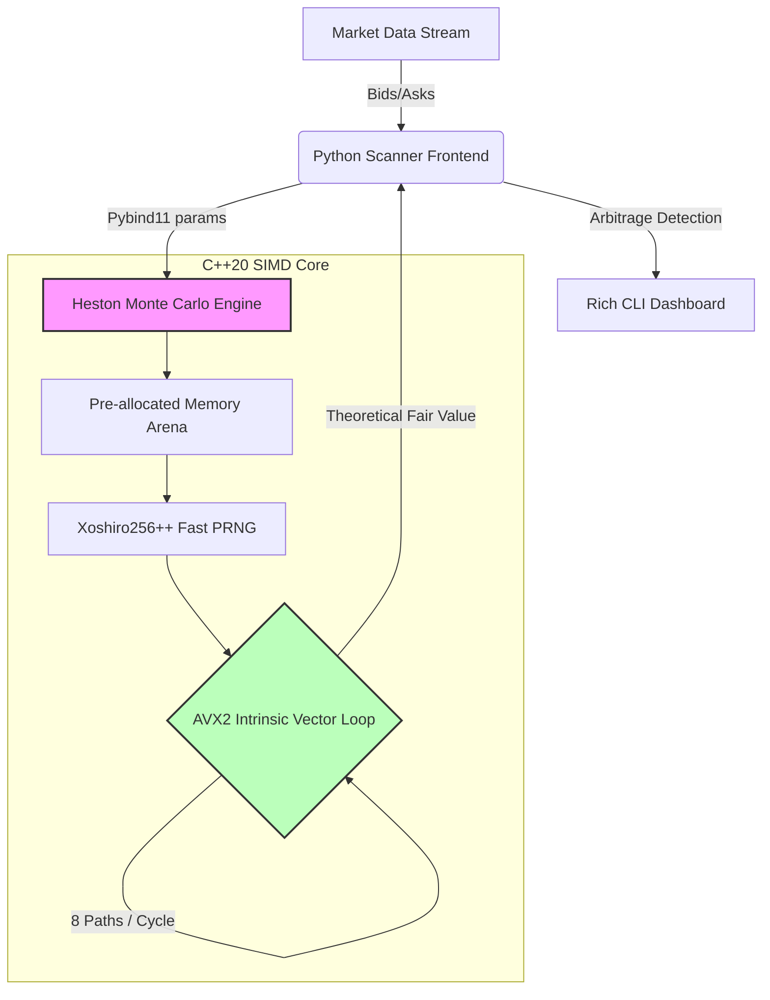

# SIMD-Accelerated Options Arbitrage Scanner

An ultra-low-latency Monte Carlo options pricing engine written in C++20, accelerated via AVX2 SIMD intrinsics, and exposed to Python via Pybind11. The engine prices options under the Heston Stochastic Volatility Model using an Euler-Maruyama discretization scheme with zero dynamic memory allocation on the hot path.

## Architecture

The system is split into a high-performance C++20 backend and a Python frontend, bridged by Pybind11.



## Key Design Decisions

- **Zero heap allocation on the hot path.** All simulation buffers (`Z1`, `Z2`, `final_lnS`) are pre-allocated during construction and reused across pricing calls. No `new` or `malloc` inside the Monte Carlo loop.
- **Custom PRNG.** Replaced `std::mt19937` with a hand-rolled Xoshiro256++ generator, seeded via SplitMix64. This eliminates PRNG overhead and produces a stream that vectorizes cleanly.
- **AVX2 intrinsics.** The Euler-Maruyama time-stepping loop is written directly in `_mm256_*` intrinsics, processing 8 price paths per cycle. The variance process uses full-truncation to prevent negative variance without branching.
- **Log-price formulation.** Simulating `ln(S)` rather than `S` directly eliminates a `log` call per path at payoff evaluation and keeps the drift term numerically stable.

## Performance Benchmarks

Benchmark environment: 12-core CPU, L3 cache 12 MB. 100,000 paths, 100 time steps per option contract.

| Implementation | Wall Time | CPU Time | Iterations |
|----------------|-----------|----------|------------|
| Scalar C++     | 534 ms    | 531 ms   | 1          |
| AVX2 SIMD      | 333 ms    | 336 ms   | 2          |

**~1.6x speedup** on the pricing loop. Scanning a full 51-strike options chain (10,000 paths per contract) completes in approximately 1.5 seconds end-to-end, including Python overhead.

## Project Structure

```
.
├── include/
│   ├── prng.hpp          # Xoshiro256++ fast PRNG
│   └── heston.hpp        # HestonMonteCarloPricer class interface
├── src/
│   └── heston.cpp        # Scalar and AVX2 pricer implementations
├── python/
│   ├── bindings.cpp      # Pybind11 module definition
│   └── test.py           # Sanity check for the compiled extension
├── tests/
│   └── pricer_test.cpp   # GoogleTest unit tests
├── benchmarks/
│   └── pricer_bench.cpp  # Google Benchmark: Scalar vs AVX2
├── scanner.py            # Live arbitrage scanner frontend
└── CMakeLists.txt
```

## Building

Requires CMake 3.24+, a C++20 compiler with AVX2 support, and Python 3.x. Dependencies (GoogleTest, Google Benchmark, Pybind11) are fetched automatically via `FetchContent`.

```bash
cmake -B build -G Ninja \
    -DCMAKE_CXX_COMPILER=<your-c++-compiler> \
    -DCMAKE_C_COMPILER=<your-c-compiler>
cmake --build build
```

## Running the Scanner

```bash
python scanner.py
```

The dashboard ingests a synthetic options chain, prices each contract against the Heston model via the C++ backend, and flags contracts where the market ask is below the theoretical fair value.

## Running Tests and Benchmarks

```bash
./build/heston_test.exe      # Unit tests
./build/heston_bench.exe     # Performance benchmark
```
